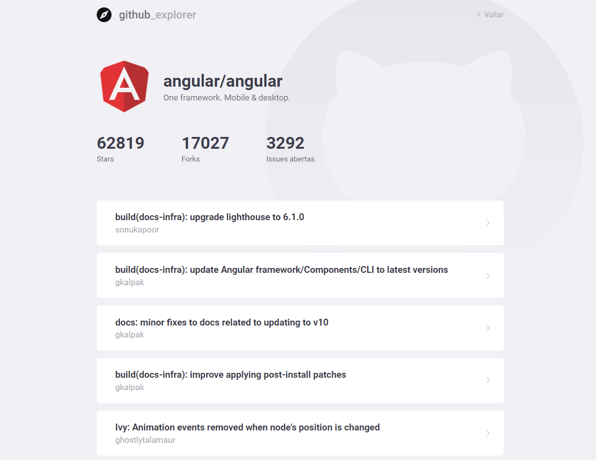

# Github Explorer

Aplicação que busca e armazena seus repositórios favoritos no **Github**

### Front-end: ReactJS, Typescript, StyledComponents
### API GitHub

----------------------------------------------------

----------------------------------------------------

## Instalação | Execução

Clone esse repositório rodando:

    git clone https://github.com/MarthinKorb/GithubExplorer

----------------------------------------------------

Abra o terminal na pasta do projeto e instale as dependências rodando o comando:

    yarn

Agora vamos iniciar nosso front-end:

    yarn start

**Feito!** ✔

Agora é só adicionar os seus repositórios na sua lista!

----------------------------------------------------

